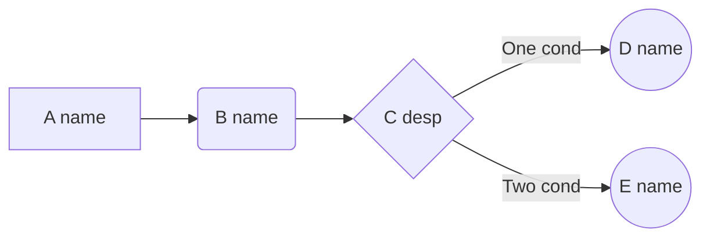
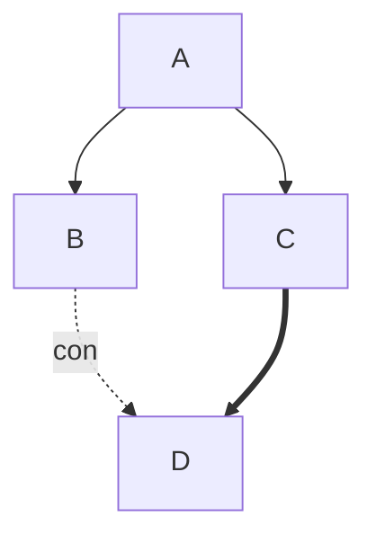
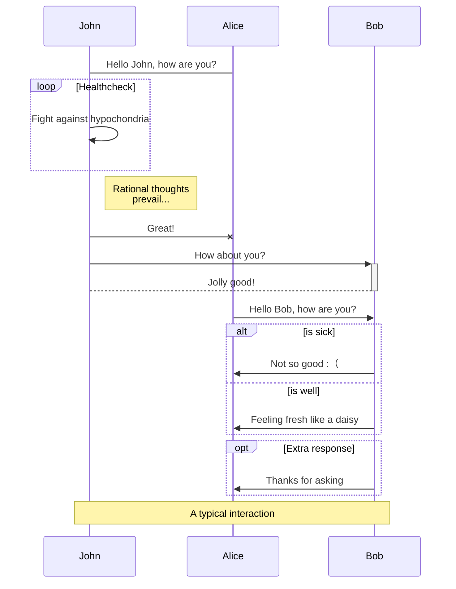

# examples of flow, sequence and kinds of mermind graph

```mermaid
graph LR
	A[A name] --> B(B name)
	B --> C{C desp}
	C -- One cond --> D((D name))
	C --> |Two cond| E((E name))
```

```mermaid
graph TB
	A--> B
	A--> C
	B-.-> |con| D
	C ==> D
```

```mermaid

sequenceDiagram
	participant John
  participant Alice
		Alice->John: Hello John, how are you?
    loop Healthcheck
        John->> John: Fight against hypochondria
    end
    Note right of John: Rational thoughts <br/>prevail...
    John-x Alice: Great!
    John->> +Bob: How about you?
    Bob--> -John: Jolly good!
    Alice ->> Bob: Hello Bob, how are you?
  alt is sick
    Bob ->> Alice: Not so good :（
  else is well
    Bob ->> Alice: Feeling fresh like a daisy
  end
  
  opt Extra response
    Bob ->> Alice: Thanks for asking
  end
  Note over John,Bob: A typical interaction
```