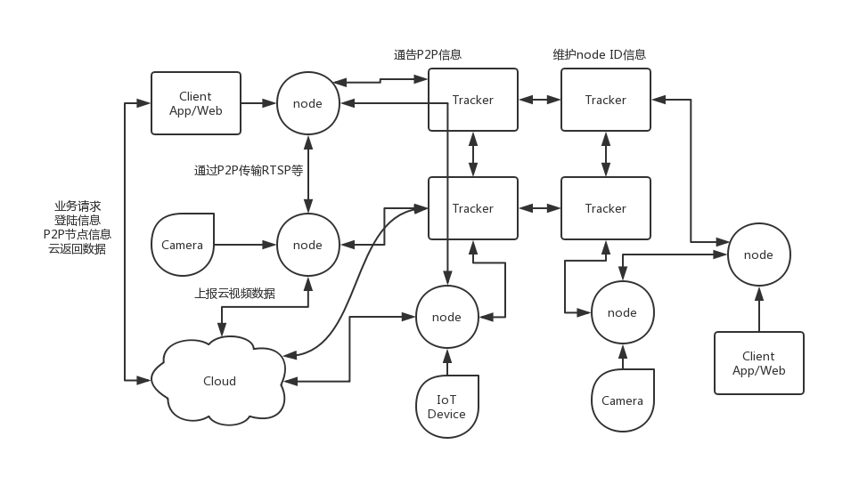

---

layout: page
category: Papers
title: 萤石开放平台与P2P-RTSP摄像头方案对比调研

---

<h1>
 萤石开放平台与P2P-RTSP摄像头方案对比调研 
</h1>

<h5>
洪国南 Jason
</h5>

## 摘要

> 　　本文立足我们现有需求及用量，分析目前萤石开放平台方案设施过程的难点及问题，并以此对比调研一套RTSP[^1] 流+P2P[^2] 云联的摄像头监录方案。
> 
> 　　从分析旧服务器萤石接入的分享摄像头逻辑到调研子账号模式，暴露出企业接入萤石平台有以下问题：服务费高昂、转发的直播时延高、终端用户对设备管理及安全体验差。基于以上不足，分析一个采用点对点P2P跨网直连的RTSP流摄像头方案。其在保留流传输优势上融合P2P技术组网，实现局域网穿透，点对点低时延传输，端到端控制与管理，从而降低依赖第三方服务收取的带宽流量成本，而且标准的流协议，端到端控制，进而可定制范围大。
> 
> 　　最后梳理采用技威厂家这一方案的可行性，及接入的流程，以及后续我们自行搭建的一些可行方案。

[^1]: RTSP: Real Time Streaming Protocol, 实时串流协议

[^2]: P2P: Peer-to-Peer, 对等式网络,点对点技术

<h2>目录</h2>

* TOC
{:toc}

<!--
[TOC]
-->

## 萤石开放平台接入分析

　　萤石开放平台先前已有调研，并在旧81/82服务器上接入摄像头，实现长沙，上海的摄像头联动拍照。在迁移到现有Ali云服务时，发现原有的分享设备接口官方已废弃，取之提供子账户模式，现引述Jetty Liu的接入流程剖析出现的难点和不足。
	
### 1.1 原方案——客户分享其绑定的摄像头供云使用

　　最直接的采用分享设备管理方式，如下流程图。（虽官方API已经废弃，但接口仍可调用，结果未知)

　　摄像头通过萤石app添加到用户账号下，并要求客户分享其设备给我们的开发者账号OB，用户在Smart App中绑定指定序列号摄像头，云端通过萤石接口完成摄像头的映射关系; 之后云端便可控制该摄像头进行场景联动拍照。在集成其SDK到我们app中，直接访问萤石私有的加密直播流可查看，但经云请求的RTSP流延迟极高。

　　其中关键步骤也是最关键的一个问题，**设备必须由用户人为在萤石App中分享给我们开发者账号**，才可在smart中设置摄像头的场景联动，这显然不现实，且不符合用户的隐私要求。

### 1.2 官推方案——B(大账户)模式的子账户

　　官方案例推广的多用户管理方案，如下示例图。

> 　　开发者账号OB，所有的开发流程都需要基于此账号进行，更重要的是，后续添加的设备与购买的服务，都归属于该账号。
> 该账号还将作为超级管理员，可以创建子账号用于关联APP的账户体系，从而实现应用内权限的分配与管理：
> 
> 　　设备添加到开发者账号下 -> 开发者账号授权设备权限给子账户A -> 用户A通过子账户A的权限来操作设备 -> 开发者将以管理员的身份使用萤石开放平台的能力

　　对比原有的分享流程，子账户方案则是通过细分主管理员账号的设备，达到多用户多权限管理，取代之前用户的人为分享流程，云端接入及应用逻辑如下。

　　摄像头将直接通过集成萤石SDK的Smart App激活入网，并添加到OB的开发者账号下，同时云端将调用ys接口创建与当前smart账号名相同的子账户，并将该设备分配到当前子用户中。至此，开发者账号将拥有该摄像头的顶级管理权，且可按需管理子用户使用权限。云端依然通过ys接口完成场景联动及推送，且集成萤石SDK的Smart将可查看该子账号下的摄像头，及其直播流。其中对于集成SDK方面，由于官方包打包方式不足，将导致Smart应用过大且版本兼容性低。
	
　　这里，需要注意一下萤石的[开发者服务费用](https://open.ys7.com/price.html)：

　　子账号对比原有的分享设备方案来说，虽免去中间人为分享过程，但也有些许问题：

- 首先，**必须通过集成萤石SDK的Smart App添加摄像头。切不可用户通过萤石App将其激活进其账户下**，为避免这问题，摄像头上激活的二维码就必须oem替换。
- 其次，用户角度来说，其摄像头直接属于OB管理账户中，隐私方面仍旧不安全。且从另一层面上，这些摄像头都是共享的状态。
- 再而，重中之重，免费用户的10台设备接入了明显不足，且随着设备数及用户使用并发增加，**流量及管理费用**成倍增长。
- 此外，其主推[EZOPEN](https://open.ys7.com/doc/zh/readme/ezopen.html)私有流协议, 而播放兼容的RTSP延时大，这对于后期需在云端做录制及视频处理带来很大困难，且依托于萤石的录制存储，需另收费。

## 以萤石为例的云摄像头接入难点及不足分析

　　综合上述对萤石开发平台的接入分析，目前接入第三方摄像头平台，都受限于其开放程度及其服务体系，尤其是第三方云多为转发视频流，若我们接入的设备量大，其产生的流量，带宽维护费将是一笔大开销。再而，第三方的定制化程度低，我们一些特定需求往往无法实现，加之终端用户对摄像头隐私比较看重，牵涉的中间转发途径太多，安全性，时延性都需考量。

### 市面上云摄像头的通性

　　就目前对市面上的云摄像头了解(参考家居云摄[国内](https://post.smzdm.com/p/656813)及[国外](https://www.pcmag.com/roundup/331547/the-best-indoor-home-security-cameras)对比)，如米家小方、小蚁，百度i耳目等一类主打家居安防摄像头，多依托于其自有云服务，功能特性基本有：

* 实时监控摄录
* 广角/全景/云台
* 红外夜视
* 运动触发抓拍
* 双向语音
* 本地循化录像
* 时间段异常报警推送
* 部分支持触发器触发动作
* 多数支持云端录制，且需用户在其app确认开启
* 多为平台生态封闭，提供少量云端控制接口
* 多采用自有的组网方式，流为经其云端加密转发，只能在其平台下的App或其相关产品查看监控
* RTSP等标准的流协议多经过二次封装，少数开放支持NVR[^3] 。

这一系列摄像头，按流传输方式区分为：

1. 摄像头与云端保持连接，客户端(多为app)请求服务器建立转发通道。通常平台生态封锁，开放度低。
2. 摄像头端与客户端直接连接推流，云作为链路的信息建立者。通常声称端到端加密，且支持多端直播，多数可web端查看监控。
3. 传统的ip-cam，支持标准RTSP流，录制仅本地，缺乏跨网连接与云端，需打通本地局域网。

　　再者，云摄像头依托于其生态平台，允许接入传感器等外界触发动作的设备，进行一些自动化的应用，多数均不开放外界接入能力，少数开放的却受其接口限制，应用上没法充分发挥。且通过云的接口控制摄像头，都无法达到即时执行特定动作，往往达不到想要的触发抓拍效果。仅仅依托摄像头自身的运动监测抓拍，能实现的联动功能远远无法满足。
　　
[^3]: NVR: Network video recorder, 网络视频记录器

### 探索适合自己的

　　结合我们酒店及楼宇类安防的需求，接入的摄像头须易配网，易管理控制，容易穿透局域网实现融合，能支持ONVIF[^4] ，RTSP等通用控制/流传的协议为佳，更需考量多端点播，NVR设备录制。尤其，针对我们的iot系统，其需支持外界传感器触发联动，若能实现本机或局域网联动通信，这将大大降低抓拍动作的延迟，再者，依托在IP图传上的研究，如能获取摄像头原始帧数据，这将方便后续增加识别等算法。

　　等等这些因素，我们需考量继续接入第三方摄像头所面临的一系列瓶颈，采用一种能方便组网，基本云摄功能涵盖全面，对云端低依赖，端到端传输，低时延，模块方便定制，接口灵活易掌控的云摄方案。

[^4]: ONVIF: [Open Network Video Interface Forum](https://www.onvif.org/profiles), 开放网络视频接口论坛

## P2P-RTSP摄像头方案分析

　　综合来看，接入第三方云摄平台为的就是不用考虑其摄像头功能及其组网细节，直接对接开放平台，实现控制与摄录，享受快速方便的同时带来定制化程度受限，服务费高昂，控制流程繁琐，延时大等麻烦。分析可见，摄像头模块的基本功能已成型，解决组网问题，封装控制/流传协议，拓展云端服务，这便是云摄方案的基本步骤。而我们若掌握组网以及控制流传的协议封装，这对于功能定制上，云端拓展服务上，自主性，开放性将大大提升，也免受第三方服务的牵制。以下将从这三部分剖析P2P-RTSP方案的可行性。
　　
### 3.1 摄像模组

　　云摄的硬件基础，鉴于IP之前的研发成果，实现一款满足上述通性的采用RTSP图传的摄像头模组问题不大，且可把控需求，获取源图像帧数据，对后续识别功能加入提供可能。再而，利于拓展iot类RF硬件，把控控制/流传协议，以及对接云端的接口定义。

### 3.2 联网——半分布式P2P

　　摄像头监控发展从有线->IP-Cam(Webcam)->现今云摄像头，一直在革新联网方式，尤其是云摄像头，解决了传统ip-cam的内网穿透[^5] 问题，连接云端带来随处随时的监控与一系列功能性便利。那么，在满足将家庭Lan中摄像头暴露供外网访问前提下，要摆脱第三方服务收取的带宽流量服务费，又要降低我们云端的负载压力，势必需要一种非中心化，又能快速访问对端设备的联网技术，P2P的设想由此而来。

　　现行BitTorrent便是运用P2P进行文件传输，即时通信软件也多采用半分布式P2P网络，如图示,详细技术细节可参考[^6] ，这里一句话概之

>  “我为人人，人人为我”

　　印证P2P可以落地到iot类或摄像头联网中，调研发现有国外摄像头讨论组已提及[P2P的ip-cam](http://cctvcamerafactory.com/blog/p2p_ip_camera)并且发现[nabto](https://www.nabto.com/solution/),一家提供P2P的实时IoT平台方案[^7] 。下图均摘自其相关阐述。

　　其核心在于搭建的多台创世节点（Tracker）通过维护众多节点(IoT设备及摄像头)的IP及端口，保持链路打通，供App，云服务器，直接端对端访问。节点均即是服务端又是客户端。

[^5]: 内网穿透：实为打通家用路由的NAT，传统ip-cam多需设置端口转发+DDNS动态地址映射才可实现外网访问，现有文中提及的反向代理技术

[^6]: P2P技术与应用参考：[Peer to Peer ( P2P ) 综述](https://docs.huihoo.com/p2p/1/index.html)

[^7]: nabtoSDK供参考：[unabto](https://github.com/nabto/unabto)

### 3.3 视频流传输——RTSP

　　在确定P2P通信可行前提下，进一步调研传输协议。现今多数nvr及大厂云摄都陆续支持ONVIF方案[^8] ，是故核心的即时串流RTSP能否采用P2P链路传输，作为云摄图传方式?

　　调研中借鉴了一篇尝试在移动网中利用P2P进行实时串流的技术文献[RTSP-based Mobile Peer-to-Peer Streaming System](http://dx.doi.org/10.1155/2010/470813)以及参考VoD点播技术，从另一角度分析，P2P最大用处即利用UDP的传输突破内网打通链路，之后应用层的协议经过适反向代理即可。

　　再而，除了图传数据流，链路的打通也提供控制流，为后续接入IoT控制，主动上传云端备份视频提供可能。如下图完整设想。

[^8]: ONVIF简解：ONVIF = 服务端 + 客户端 =（Web Services + RTSP）+ 客户端 = （（WSDL + SOAP） + RTSP） + 客户端

### 3.4 其他拓展

　　在分析摄像头参数及方案中，总结为以下的拓展需求：

- uPnP支持，网内设备发现，路由的端口转发，流媒体服务器支持
- ONVIF,含控制与RTSP流传，支持对接nvr
- http, 页面端查看及配置，基本ip-cam功能
- 对接云端上传视频、图片
- 外部触发联动，如IFTTT
- 内部触发联动接口

## 对接技威方案及今后拓展

　　在P2P-RTSP相关可行性调研中，发现国内有一家提供此方案的公司，技威时代[GwellTimes](http://www.gwell.cc)，提供其的基于Cloudlink™ P2P的智能家居平台（摄像头为主）的公版以及相关开发工具集。因此，初期是否考虑使用其方案做二次开发。

　　以下是对该公司方案应用的产品及其对外推广的Yoosee一些调研。
　　
### 方案应用产品及以Yoosee为模版的应用定制

　　该公司为方案公司，其搭建了一套P2P的智能家居平台组网系统，目前应用多为云摄像头类，并为其开发一套模版App SDK[^9] （iOS/Android），对外应用推广为 有看头 [Yoosee](https://www.yooseecamera.com)，归纳为：

- 公版的型号参数如图：

- 市面上基本的云摄功能（上述）已涵盖
- P2P 连接
- 支持ONVIF标准，可接入NVR/VMS
- 配网支持二维码扫描，声波联网，部分设备支持网线直连
- 其云支持云端录制，并且为按客户按月计费
- 其云有账号体系
- 支持外部触发，报警推送
- 应用端已有Yoosee模版应用，其他厂家App都基于此OEM
- PC上有CMSClient，可多路同时查看

　　据了解，目前市面上有以下几个品牌为采用其方案并深度定制销售自己产品：[联卫安防unifore](https://www.unifore.net)，是yoosee推广的厂家,查无国内成品销售; 乔安，主要做监控摄像头，京东，淘宝销量产品有150+，售价在100-400，已购买使用； 以及一些称为小雪人ipcam产品，厂商未知。

　　联系该公司，得知使用其供货厂商的摄像头模组是无需收纳接入平台的费用，可从厂商处获得接入平台的appkey，其公司主要负责运维P2P的接入服务器，提供SDK的接入支持及OEM定制，也可提供公版模组，但价格未答复。

[^9]: Yoosee 基于Cloudlink™ P2P的智能家居平台[工具集](http://sdk.yoosee.co/#/doc)

### 个人使用体验及对比

　　本人已在使用3台乔安的监控摄像头，对比米家的小蚁摄像头，基本功能完善，入网方式，摄录，双向对讲，本地循环录制，运动监控报警等均无明显差异，在体验其P2P方式的直播流上，延迟也与小蚁的近，app端从打开登陆到打开摄像头流约为3s，摄像传输延迟大约在2-5s。

　　应用使用上，分别为yoosee-ios-App端及CMSClient-PC端参考截图：
　　

　　结合使用及其开放的SDK(iOS部分)，从账号注册，登陆，微信登陆，添加设备，配网，功能设置，推送这些，功能性完善，接口开放也具备，收费云端录制使用体验与机内视频，照片的获取方式无差，尤其是配网已集成扫码及声波，分享逻辑也具备，定制程度很高，注意一点是，app及开放接口预留传感器触发，但目前无设备支持，没法体验。PC端的CMSClient，软件实现NVR，可最大32路同时监控及本机录制，具备app上的登陆及控制管理功能，另外具备局域网发现。
　　更多信息，经其技术论坛[^10] 的开发者研究及其他技术手段知道，其摄像头默认通告大约30多个traker服务器上线状态，并利用摄像头中固化的UID作为P2P的连接识别码，Traker国内服务器多数为ali-yun，部分国外为aws，且经过app设定RTSP密码后，利用VLC可以连接其视频流，采用onvif连接可实现控制。

[^10]: [Yoosee技术论坛](https://support.yooseecamera.com)

### 对接路线及今后拓展

　　初期，拟考虑采用其公版做一些功能整合，并接入其SDK，完成基本功能使用。进而尝试实现传感器触发联动拍照，经云端去拉取存于机的视频或照片，之后依据其硬件接口的开放程度，增加其他功能，以及实现云端的监控录像。

　　在确立方案可用并投入使用后，逐步尝试搭建自己的P2P Tracker服务器，同时硬件上采用我们的摄像头模组接入P2P，尝试复制其完整方案。目前使用其产品发现基于安全性考虑及硬件负载的考虑，屏蔽了P2P本身的多对多连接，即单点登录，单点串流，但其云端录制不受限制。今后我们尝试复制的过程中，可突破此限制，让摄像头优先录制到本机，空闲时主动上传或推送抓拍视频，图片文件至我们的云录制，维持端到端连接的同时，也最大限度降低云录制的负载。
　　
## 总结
　　在接入使用萤石开放平台的过程中，暴露出若继续接入第三方摄像头所面临的一系列应用瓶颈。而结合P2P的端端传输优势以及我们自有的技术积累，尝试接入技威这一P2P云摄方案，并逐步借鉴，化为己有，从何获得一个自由度高，需求定制灵活的自主云摄平台。

> 该调研带有个人主观意见，剖析问题可能不够全面，且缺乏方案的细致市场调查，凭只言片语阐述使用体验，请谅解！此并感谢同事提出的相关意见建议！

## 参考及引用

> 部分已在文中链接跳转
